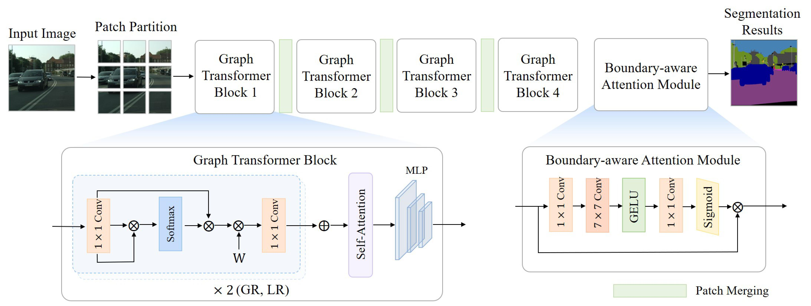

## Graph-Segmenter: Graph Transformer with Boundary-aware Attention for Semantic Segmentation


<p align="center">
    
</p>


## Get start
### Installation

Please refer to [get_started.md](https://github.com/open-mmlab/mmsegmentation/blob/master/docs/get_started.md#installation) for installation and dataset preparation.


## Citing Graph-Segmenter
```
@article{liu2021Swin,
  title={Graph-Segmenter: Graph Transformer with Boundary-aware Attention for Semantic Segmentation},
  author={Zizhang Wu and Jun Li and Yuanzhu Gan and Muqing Fang and Tianhao Xu and Fan Wang},
  year={2022}
}
